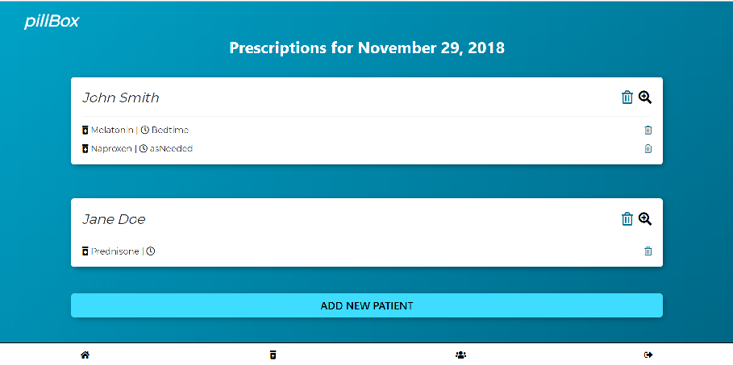
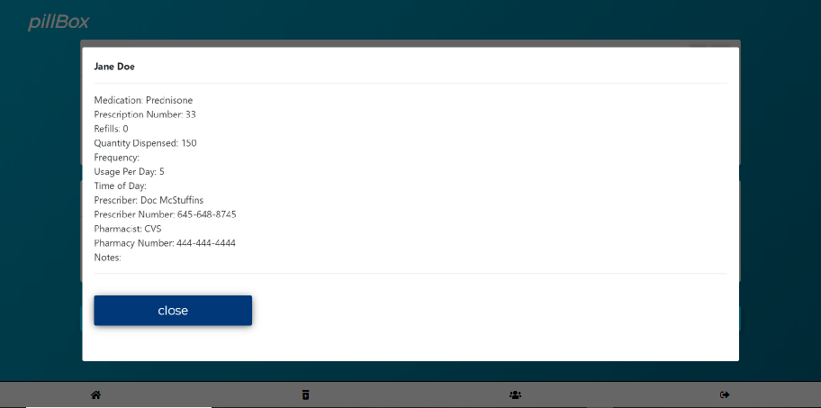
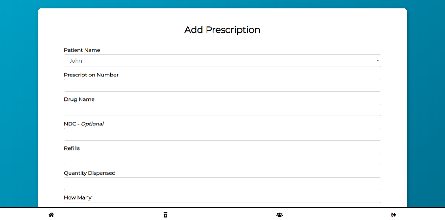

# pillBox
*The digital Rx aid*

## Overview
Managing multiple medications can be tricky, and if done incorrectly, even dangerous. Parents of sick children, caretakers of the elderly, and medically fragile individuals are often left scrambling to remember when pills should be taken, the dosage, and instructions. PillBox was born out of the need to easily track medications. After signing up for pillBox with a secure log-in, users can add different "patients" to track prescriptions, whether it be children, parents, or even themselves.  Since most people need to take medicine on-the-go, pillBox was created with a mobile-first format.  The dashboard gives the user a quick overview of everyone whose prescriptions are being tracked as well as delete a medication or get an in-depth look at a particular patient, and the bottom navigation bar allows the user to easily add a new patient to track, a new medicine, or log-out.

## Developers' Toolkit
PillBox was created with React.js.  Additional tehnologies include:
1. Backend: MySQL, Sequelize, Axios, Express
2. Frontend: Bootstrap, [React Bootstrap](https://react-bootstrap.github.io/), [React Moment](https://www.npmjs.com/package/react-moment), [Passport.js](http://www.passportjs.org/), Passport Web Token, Passport Local, CSS

## Developers
[Alex Bowen](https://github.com/alex-bowen), [Julie Hodges](https://github.com/jivinjules), [James Peek](https://github.com/jpeek01)

## Visit pillBox on Heroku
[Pillbox on Heroku](https://pacific-hollows-45719.herokuapp.com/)

